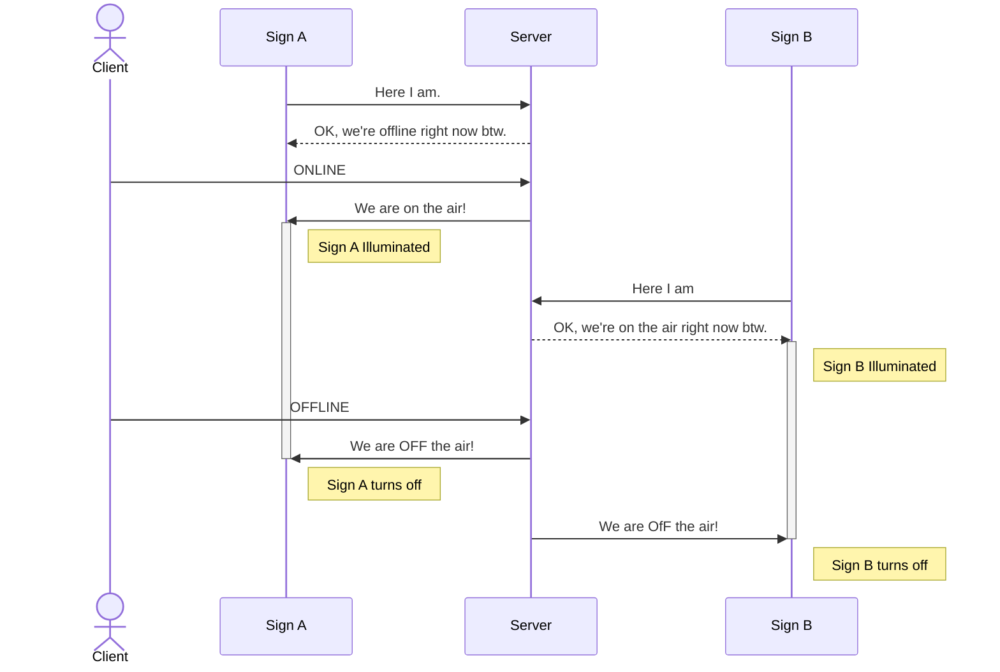
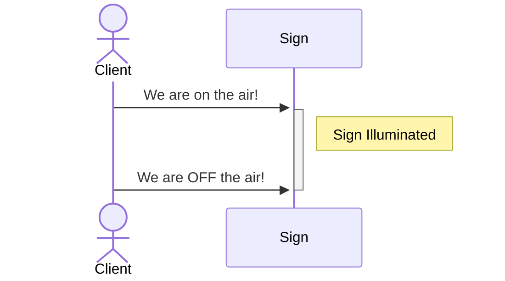

IoT "On Air" Signs
==========

This is a suite of sotware to enable internet-of-things "On Air" signs to indicate when you're "On Air" - in a meeting, on a video call, recording, or maybe even immersed in a video game and don't want to be interrupted.

There would be some small computer embedded in a sign and able to toggle it between "active" and "inactive" states.
You can either have a single station (PC, laptop, etc) directly toggle a single sign, or you can put an "OnAir Server" in the middle to keep 1 or more signs in-sync with 1 or more stations.

This was built for a Raspberry Pi Zero W - a cheap, low-power embeddable computer. However, it's not explicitly limited to the Raspberry Pi.
Limited instructions will be provided where possible, but this is not an off-the-shelf product; you are expected to DIY.

Getting Started
==========

1. Run the server somewhere
    * see the [server README](./server) for details
2. Run the sign code on the same machine, sign and tell it to register with your server
    * see the [sign README](./sign) for details
3. On the server, run
    * `curl -X PUT -H "content-type: application-json" -d "true" http://localhost:5000/onair/api/v1/state` to turn the sign ON
    * `curl -X PUT -H "content-type: application-json" -d "false" http://localhost:5000/onair/api/v1/state` to turn the sign OFF
4. Run the client code on your actual client machine, pointed at your server
    * see the [client README](./client) for details
5. Build an IoT device that can run the sign code
6. go on-air on your client, and watch your server tell your sign to turn on and off!

Architecture
==========

Do you need a Server or not?

* **Client:** A process that runs on the device a human uses when going "on air." A PC or Laptop, usually.
* **Server:** A service running somewhere. Ideally not on a client's machine.
* **Sign:** A process that will be told "on-air" or "off-air" and is expected to toggle some kind of indicator.

With Server
----------

The most-versatile setup utilizes a persistent server to manage the state of "On Air" or not. Clients report to the server when they go on or off the air, and the server pushes that out to all the signs.
When a Sign starts up, it can "register" with a Server. When state changes, the server will push updates out to every registered sign.
This enables signs to "come and go" as they are connected or disconnected, and to always change to the correct state when coming online for the first time.

> Basically, you Sign A is an "On Air" sign outside your studio that you can't see, and Sign B is a sign inside your studio that you can see. And either one can be unplugged accidentally or on purpose, and will still work just fine as soon as it's plugged back in.

Without Server
----------

The most basic setup has a client push udpates directly to a sign.

If a sign comes online after a client, it will remain in its default state until the client pushes a new update. This means that if a sign crashes or restarts, once it comes back online it will stay OFF until the client goes offline and on again.

This is because the clients do not run a server and do not accept any internet connections from the outside world. Consider running an OnAir server somewhere for the most-reliable experience.
