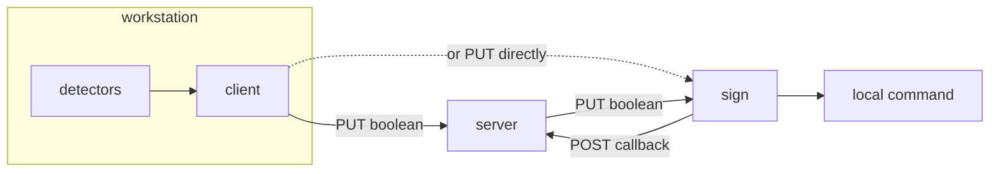

# System Patterns

## How This System Works

Three processes share one boolean: on-air or not.

1. A **client** on a human's machine watches local signals and PUTs that boolean
2. An optional **server** stores the boolean and PUTs it to every registered sign
3. A **sign** accepts that boolean and runs a local command to flip hardware

The HTTP contract is the same path on server and sign: `/onair/api/v1/state` (GET/PUT a JSON boolean). Signs additionally POST their callback URL to `/onair/api/v1/register` and receive the current boolean back.

Without a server, the client PUTs the sign directly. The sign does not ask anyone for current state on startup, so a restart leaves it off until the next client transition.

When a server is used, it is the source of truth: a JSON file for the boolean, SQLite for sign URLs. The server must be able to open an HTTP connection to each sign. Signs that fail three notifies in a row are dropped and must register again.

## Last write wins

Multiple client detectors run in parallel threads and each may PUT true or false independently. There is no OR-merge. A detector going idle will turn the whole system off even if another detector still thinks it is on-air.

## Toggle modules are import paths

The client loads detectors with `importlib` from `--toggle` dotted paths. Each module must expose `run_and_call(callback)`. The callback is expected to return the new boolean on success and `None` on failure so the detector can refuse to advance its local memory.

## Sign hardware is a command

The sign does not contain relay logic. It substitutes `@STATUS@` with `true`/`false` in a trailing command. By default the command runs only when the sign's own remembered state changes; `--idempotent` runs it on every update. The Pi Zero W install wires this to `sign-state` plus hidapitester.

## Process-local state files

Server and sign persist the boolean in `onair-state.dat` in the process working directory (gitignored). The server also uses `onair.db` next to `server.py`. Changing cwd or running two instances in the same directory will collide.

## Signs must be reachable from the server

Registration is "sign calls in, server calls back." NAT, bind address, and the sign's `--host` override are load-bearing. Listing registered signs is localhost-only.
